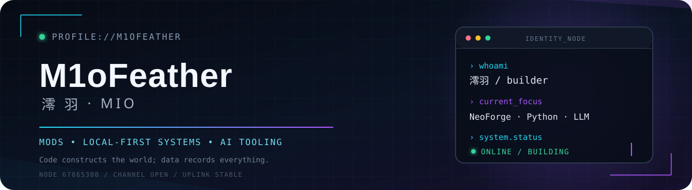

<!-- M1oFeather · GitHub Profile -->

  
    
  
  
  
    
  <strong>把游戏里的想法做成可运行系统，也把工具做成长期可维护的作品。</strong>
   
  NeoForge 原生模组 · Python / TypeScript 应用 · LLM 与本地优先知识系统

 

### `01 // SYSTEM_PROFILE`

> `HELLO, WORLD.` 我是澪羽，一名喜欢把复杂想法落成完整产品的开发者。

- **主航道**：Minecraft / NeoForge 原生模组、服务端工具与渲染兼容
- **第二现场**：Python 应用、Bot 框架、Web 工具与自动化工作流
- **持续探索**：LLM API、本地优先知识系统、可审计的人机协作
- **构建原则**：原生优先、边界清晰、可维护、让用户看得见系统状态
- **协作信号**：欢迎技术交流、开源共建与有趣项目的架构讨论

---

### `02 // SELECTED_BUILDS`

| Project | Signal | Core stack |
| :--- | :--- | :--- |
| **[Command Block Studio](https://github.com/M1oFeather/CommandBlockStudio)** | 把原版命令方块界面升级为带补全、诊断、文档与工作区能力的开发环境 | Java · NeoForge |
| **[Rhine-Vault](https://github.com/M1oFeather/Rhine-Vault)** | 本地优先、审批驱动、可解释检索的知识图谱与上下文引擎 | Python · FastAPI · TypeScript |
| **[NeoCTM](https://github.com/M1oFeather/NeoCTM)** | 无需 Fabric 兼容层的 NeoForge 原生连接纹理与发光纹理支持 | Java · Rendering · NeoForge |
| **[Neoplay](https://github.com/M1oFeather/Neoplay)** | 在服务端录制 Replay Mod / Flashback 回放，并提供服内查看与下载 | Kotlin · Java · NeoForge |
| **[AcgDraw](https://github.com/M1oFeather/AcgDraw)** | 面向多款二次元游戏的模拟抽卡图片合成 API | Python · FastAPI · Pillow |

---

### `03 // CORE_MODULES`

  
  
  
  
   
  
  
  
  
  

---

### `04 // TELEMETRY`

  
  

---

### `05 // NETWORK_PORTS`

  
  
  
    
  
    
  <code>[ SYSTEM ] Channel ready · Build something interesting.</code>

